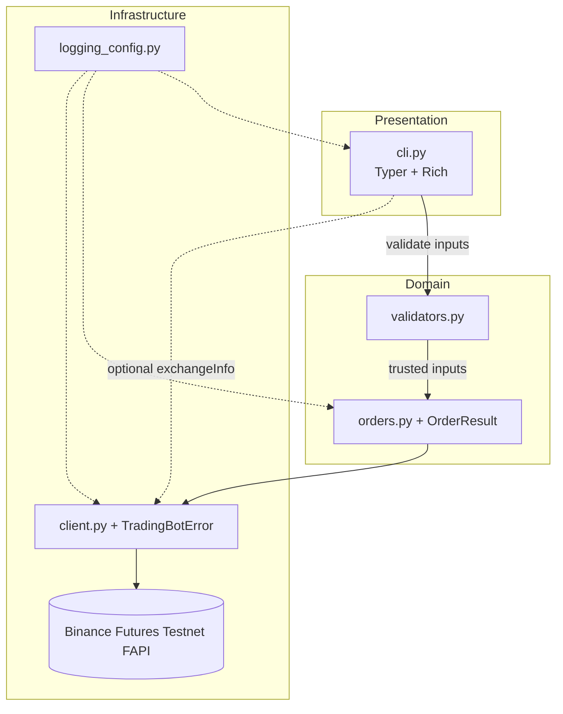
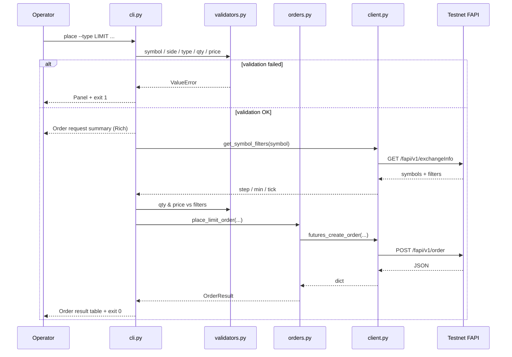

<h1 align="center">Binance USDT-M Futures Testnet CLI</h1>

<p align="center">
  <em>Modular Python CLI for validated order placement, structured logging, and testable boundaries.</em>
</p>

<p align="center">
  <a href="https://www.python.org/downloads/"></a>
  <a href="https://typer.tiangolo.com/"></a>
  <a href="https://rich.readthedocs.io/"></a>
  <a href="https://pytest.org/"></a>
  <a href="https://docs.astral.sh/ruff/"></a>
  <a href="https://www.mypy-lang.org/"></a>
</p>

<p align="center">
  
  
  
</p>

> **CI badge:** After publishing, replace the static CI row with a live workflow badge from `https://img.shields.io/github/actions/workflow/status/<owner>/<repo>/test.yml?label=CI` (or remove if Actions are unused). The **“build passing”** badge is static here by design until CI is wired to your repo.

---

## Table of contents

- [Assignment context \& solution overview](#assignment-context--solution-overview)
- [Key features](#key-features)
- [Architecture \& flow](#architecture--flow)
- [Project structure](#project-structure)
- [Quick start](#quick-start)
- [Engineering design decisions](#engineering-design-decisions)
- [Future extensibility](#future-extensibility)
- [Assumptions \& limitations](#assumptions--limitations)
- [Author / submission note](#author--submission-note)

---

## Assignment context & solution overview

📋 **Scope:** internship-style CLI for Binance Futures **Testnet** (USDT-M).

This project implements a **small Python CLI** aligned with an internship-style brief: execute **MARKET** and **LIMIT** orders on [**Binance USDT-M Futures Testnet**](https://testnet.binancefuture.com), with **validated user input**, **file logging**, and **robust error handling**.

The codebase is deliberately **layered**, not monolithic:

- The **presentation layer** (`cli.py`) handles Typer/Rich UX, exit semantics, and the only user-validation gate.
- **Domain rules** (`validators.py`) stay importable and unit-test friendly.
- **Orchestration** (`orders.py`) maps trusted inputs → API parameters → a typed **`OrderResult`**.
- **Infrastructure** (`client.py`) wraps `python-binance`, normalizes testnet endpoints, maps failures to **`TradingBotError`**.
- **Observability** (`logging_config.py`) separates verbose file diagnostics from quieter console output.

Extended design rationale and phased implementation notes live in **[`implementation.md`](implementation.md)** (committed for reviewers).

---

## Key features

✨ **Capabilities at a glance:**

| Area | Capability |
|------|-------------|
| **Orders** | **MARKET** and **LIMIT** on USDT-M testnet (**BUY** / **SELL**). |
| **Interactive UX** | Wizard with re-prompts, **Rich** preview, and confirm-before-send. |
| **Direct CLI** | `place` prints an **order request summary**, then submits (no y/N gate). |
| **Validation first** | Invalid input fails **before** any signed HTTP traffic. |
| **Exchange filters** | Fetches **`exchangeInfo`** LOT_SIZE / PRICE_FILTER; pure numeric checks in validators. |
| **Logging** | Rotating **DEBUG** file handler + elevated-threshold console (Rich-friendly). |
| **Errors** | `TradingBotError`; clock skew **`-1021`** surfaced with remediation text. |
| **Contract** | **`OrderResult`** dataclass — no raw REST blobs on the CLI boundary. |
| **Automation** | Process exit **`0`** success · **`1`** validation · **`2`** API/network. |
| **Quality** | `pytest`, `pytest-cov`, `ruff`, `mypy` (see [**Quick start**](#quick-start)). |

---

## Architecture & flow

### Layered architecture



### Limit order sequence (happy path & exit codes)



> **Note:** On API failure after the request, the CLI renders `TradingBotError` and exits **`2`**.

---

## Project structure

📁 **Layout** (omit `.venv/` / caches from submissions):

```text
trading_bot/
├── bot/
│   ├── __init__.py          # Public package exports (client, orders, logging, errors).
│   ├── client.py           # BinanceFuturesClient, FAPI base URL override, TradingBotError, -1021.
│   ├── orders.py           # place_market_order / place_limit_order, OrderResult mapping.
│   ├── validators.py       # Pure validation (+ filter math); no SDK imports required.
│   └── logging_config.py   # Rotating file DEBUG + Rich console policy.
├── tests/
│   ├── test_validators.py
│   ├── test_orders.py      # Mocked client; mapping & param construction.
│   └── test_client.py      # Binance → TradingBotError mapping (offline).
├── logs/
│   └── samples/             # Submission excerpts (MARKET / LIMIT DEBUG trail).
├── cli.py                   # Entry: place | interactive | account.
├── pyproject.toml           # Ruff, mypy, pytest defaults.
├── requirements.txt       # Runtime: python-binance, typer, python-dotenv, rich.
├── requirements-dev.txt    # pytest, pytest-cov, ruff, mypy, types-requests, pytest-mock.
├── Makefile                 # Optional: install | test | lint | format | typecheck.
├── implementation.md       # Architecture & phased plan (engineering artifact).
├── README.md                 # ← You are here
└── .env.example             # Keys template (.env stays local & excluded from VCS).
```

---

## Quick start

### 1 · Clone

```bash
git clone <repository-url>
cd trading_bot   # repo root containing cli.py + bot/
```

### 2 · Virtual environment

**Windows (PowerShell)**

```powershell
python -m venv .venv
.\.venv\Scripts\Activate.ps1
python -m pip install --upgrade pip
```

**macOS / Linux**

```bash
python3 -m venv .venv
source .venv/bin/activate
pip install --upgrade pip
```

### 3 · Dependencies

```bash
pip install -r requirements.txt -r requirements-dev.txt
```

### 4 · Environment

Copy `.env.example` → `.env` and add **TESTNET-only** credentials from [**Futures Testnet**](https://testnet.binancefuture.com).

```bash
cp .env.example .env
# Edit BINANCE_API_KEY and BINANCE_API_SECRET — never commit .env.
```

Optional variables (`LOG_FILE`, `LOG_LEVEL`) are documented in `.env.example`.

### 5 · Run orders

Help & account sanity check:

```bash
python cli.py --help
python cli.py account
```

**Market** (prints request summary, then submits):

```bash
python cli.py place --symbol BTCUSDT --side BUY --type MARKET --qty 0.001
```

**Limit:**

```bash
python cli.py place --symbol ETHUSDT --side SELL --type LIMIT --qty 0.01 --price 3500
```

**Interactive** (menus, retries, confirmation):

```bash
python cli.py interactive
```

Adjust **qty** / **price** to satisfy testnet **`LOT_SIZE`** and minimum notional if the exchange rejects an order.

### 6 · Quality gates

```bash
ruff check bot tests cli.py
ruff format bot tests cli.py --check
pytest tests/ -v --cov=bot --cov-report=term-missing
mypy bot
```

**Makefile** equivalents: `make install`, `make test`, `make lint`, `make format-check`, `make typecheck`.

### CI (optional)

`.github/workflows/test.yml` lives at the **same level as `cli.py`** (flat `trading_bot/` repo root) with **no** `working-directory` override. Push to `main` / `master` or open a PR to run lint, format check, `mypy`, and `pytest` on Python 3.11 and 3.12.

---

## Engineering design decisions

🧭 **Rationale distilled:**

1. **Validation before network calls** — Failing fast avoids unnecessary signed requests, clarifies **`exit 1`** vs **`exit 2`**, and keeps rate-limit headroom.

2. **`OrderResult` without raw payloads** — The orchestration layer maps Binance JSON to a **small**, stable schema. Raw bodies remain in **DEBUG logs** during development, limiting SDK schema drift across the CLI.

3. **Split logging policy** — A **DEBUG** rotating file preserves an audit trail (`place_*` params, response key sets, exceptions). Console handlers stay quieter so operators are not drowned in **`urllib3`** noise during interactive sessions.

4. **Modular boundaries** — Isolating `client.py` means exchange SDK quirks, URLs, and error codes are **localized**. Replacing Binance or adding a second connector becomes a constrained change-set rather than a CLI rewrite.

---

## Future extensibility

| Direction | Fit |
|-----------|-----|
| **HTTP API** (e.g. FastAPI) | Reuse **`validators`** + **`orders`** + **`BinanceFuturesClient`** behind route handlers; keep Typer CLI as optional admin tooling. |
| **Jobs / schedulers** | Call `orders.place_*` from workers; exit-code conventions map cleanly to job success/failure. |
| **More venues** | Introduce an `ExchangeClient` protocol; keep **`OrderResult`** as the facade DTO where possible. |
| **Strategies** | Strategies depend on **`orders`** primitives; they should not embed HTTP or Binance enums directly. |

---

## Assumptions & limitations

⚠️ **Honest boundaries:**

- **Testnet only** — Do not reuse this wiring for production funds.
- **Python 3.10+** (tested locally on 3.11–3.14 class interpreters; CI matrices typically use 3.11/3.12).
- **Funded Futures Testnet wallet** sufficient for chosen symbol minimums.
- **Exchange filters** are retrieved **live** via `exchangeInfo`; if that call fails, the CLI warns and may still proceed (Binance may then reject precision / notional).
- **Retries, backoff, circuit breaking** — not implemented; synchronous calls rely on SDK and transport defaults.
- **WebSocket / streaming**, **persisted state**, advanced order types (**OCO**, grids, TWAP, etc.) — out of scope for this submission.
- **`logs/trading_bot.log`** — May contain **`urllib3`** lines including **signed URLs** during development. **Redact before sharing.** Submission copies belong under **`logs/samples/`**.

---

## Author / submission note

✍️ This submission emphasizes **maintainability**: layered modules, typed boundaries, deterministic exit codes, actionable logging, automated tests, and lint/type gates. It is deliberately written so additional interfaces (CLI, HTTP, batch jobs) can share the same **core** without duplicating validation or Binance coupling.

Submitted per employer / course instructions via public GitHub (**`<repository-url>`**) or zipped **`trading_bot/`**, excluding **`.env`**, **`logs/trading_bot.log`**, **`__pycache__`**, caches, and **`.venv`**.

---

<p align="center"><sub>Designed for readability in GitHub’s Markdown viewer. Mermaid diagrams require a renderer that supports fenced <code>mermaid</code> blocks.</sub></p>
