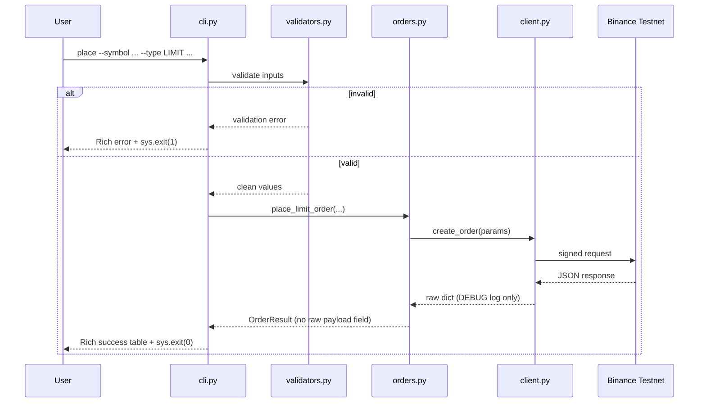
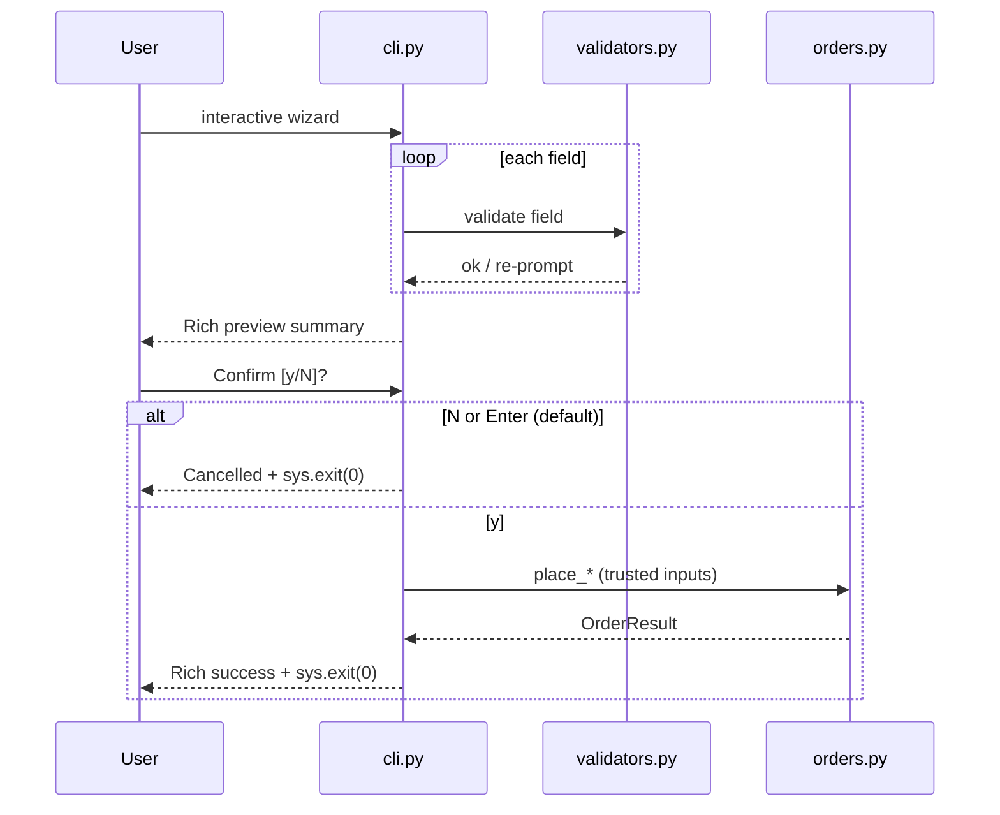

# Trading Bot — Implementation Master Plan (Cursor-Optimized)

**Document purpose:** Single source of truth for building, testing, packaging, and submitting the Binance USDT-M **Futures Testnet** trading CLI.  
**Referenced materials:** This plan synthesizes the layered architecture strategy, the Claude-style audit refinements (`OrderResult`, `tests/`, `logs/samples/`, `TradingBotError`), and the phased roadmap you provided. *If `Python Developer Intern Assignment.pdf` or `Trading_Bot_Roadmap.docx` add constraints beyond this file, merge those into “Assumptions & assignment alignment” before coding.*

**Repository policy:** `implementation.md` is a **first-class deliverable** — **commit it to the repo** so reviewers can see design intent and evolution. The **Mermaid diagrams** in [Section J](#j-architecture-diagram) must be **replicated (copy-paste) into `README.md`** so readers do not need to open this file to see architecture.

---

## A. What is the task

Deliver a **modular Python application** that:

1. Connects to **Binance USDT-M Futures Testnet** (not mainnet).
2. Exposes a **CLI** (Typer + Rich) to place **market** and **limit** orders with validated inputs.
3. Separates concerns into **CLI → validation → order orchestration → API client**, so the core can be reused without the terminal UI.
4. Produces **auditable logs** (file + sensible console behavior) and **submission artifacts** (sample log extracts under `logs/samples/`).
5. Includes **unit tests** for validators (and optionally order mapping) to demonstrate production-minded engineering.
6. Ships with **README** (including architecture diagrams + quality commands), **`.env.example`**, **`.gitignore`**, **`requirements.txt`** + **`requirements-dev.txt`** (pytest, coverage, **ruff**/Black, **mypy**), **`pyproject.toml`** (tool configs), optionally **`Makefile`** and **`.github/workflows/test.yml`**, and **committed `implementation.md`**, with **`.env` never committed**.

The hiring/review bar is not “it runs once” — it is **typed boundaries** (`OrderResult` without leaking raw API payloads), **tested validation** (with **coverage**), **PEP-8–aligned style** (automated **lint/format**), **optional static typing discipline** (**mypy** on `bot/`), **clean error surfacing** (`TradingBotError`, including **timestamp skew**), **deterministic process exit codes**, and **traceability** (full raw JSON only at **DEBUG** in the log file — not on the `OrderResult` object).

---

## B. What we are building

A **two-layer (presented as four modules) Python package** plus CLI entrypoint:

| Layer | Responsibility |
|--------|----------------|
| **Interface** | `cli.py` — **sole gatekeeper** for user input: calls `validators.py` (and optional exchange-filter helpers) before any order call; deterministic `sys.exit` codes |
| **Validation** | `validators.py` — rules + (optional) **pure** helpers that consume pre-fetched filter metadata; no “mystery” validation inside `orders.py` |
| **Orchestration** | `orders.py` — build Binance payloads, call client, map responses → `OrderResult` (**trusts** CLI-validated inputs) |
| **Infrastructure** | `client.py` — python-binance wrapper, testnet base URL, error translation |
| **Cross-cutting** | `logging_config.py` — rotating file logging + console policy |

We are **not** building a strategy engine, charting, or autonomous agent — only a **safe, testnet-only execution shell** with excellent structure for future extension.

---

## C. What it does (behavioral specification)

### User-facing flows

1. **Direct CLI:**  
   `python cli.py place --symbol SYMBOL --side BUY|SELL --type MARKET|LIMIT --qty ... [--price ...]`  
   - Validates inputs before any network I/O.  
   - Executes on testnet via signed HTTP (through `python-binance`).  
   - Prints a **Rich summary** (symbol, side, type, qty, price if limit, status, order id if present).

2. **Interactive mode:**  
   `python cli.py interactive`  
   - Step-by-step prompts (symbol, side, order type, quantity, price when needed).  
   - **Per-field `while` loops:** if validation fails, print the inline error and **re-prompt only that field** — do not abort the whole wizard or crash on the first bad value.  
   - **Final safety gate:** after **all** fields validate, show a **Rich preview table** summarizing the order (symbol, side, type, qty, price when applicable). Prompt once: **`Confirm and place? [y/N]`** — only on explicit **yes** (e.g. `y` / `yes`) may `cli.py` call `orders.py`. Default **No** skips the API call cleanly (recommended: print “Cancelled.” and **`sys.exit(0)`** — not a failure).

3. **Account info (recommended if assignment asks for “proof of connection”)**  
   - e.g. `python cli.py account` → balances/positions/account summary **as permitted by testnet API** without over-scoping.

### Internal flows

1. **Validation gate (CLI-only):** `cli.py` drives all validation **before** calling `orders.py`. Invalid user input never reaches orchestration.
2. **Order construction:** `orders.py` maps trusted Python values → Binance Futures order params dict.
3. **Execution:** `client.py` signs and sends; **DEBUG file log** may record sanitized request/response detail; **never** attach full raw JSON to `OrderResult`.
4. **Response mapping:** raw JSON → `OrderResult` with **only** the fields the CLI needs (ids, status, qty, price fields, etc.).

### Process exit codes (deterministic)

| Code | Meaning |
|------|--------|
| `0` | Success — order path completed (or successful no-op command where applicable). |
| `1` | **Validation failure** — caught **before** any network/API call to Binance. |
| `2` | **API / network failure** — surfaced as `TradingBotError` (or wrapped transport errors) after attempting the call. |

Implement with explicit `sys.exit(...)` (or Typer’s exit helpers) so behavior is the same in direct and interactive modes. **Direct `place` flags** intentionally skip the y/N wizard (explicit flags are treated as deliberate); the confirmation gate applies to **`interactive`** only unless you deliberately add `--dry-run/--confirm` later (out of scope unless assigned).

---

## D. Approach (engineering principles)

1. **Fail fast locally:** all user-driven validation completes in the CLI layer → fewer rate limits, predictable **exit 1**.
2. **Strict layer contracts:** **`orders.py` does not re-validate** CLI inputs; it assumes the CLI already enforced symbol/side/type/qty/price and (if implemented) exchange filter rules.
3. **Isolate Binance specifics:** only `client.py` should deeply understand `BinanceAPIException` / SDK types; everyone else sees `TradingBotError` + structured logs. Map **`-1021` (timestamp ahead/behind)** to a dedicated user message: *“System clock out of sync — check your local time settings (must be within 1000ms of server).”*
4. **Typed results at boundaries:** `OrderResult` is the contract between `orders.py` and `cli.py` — **omit `raw_response`**. Discard unneeded JSON at the mapper; **`logs/trading_bot.log` at DEBUG** is the only canonical place for full raw payloads in development/diagnostics.
5. **Observable system:** rotating file log at DEBUG for troubleshooting; console policy avoids spam (e.g. **RichHandler at WARNING** unless you add an explicit verbose flag later).
6. **Testnet routing is explicit:** after constructing the SDK client with `testnet=True`, force the futures REST base used for USDT-M calls so requests **cannot drift to Spot testnet**:

   ```python
   self._client = Client(api_key, api_secret, testnet=True)
   self._client.FUTURES_URL = "https://testnet.binancefuture.com/fapi"
   ```

   *(Exact attribute name must match installed `python-binance` — verify once in your venv if the library aliases `Futures` URL differently.)*

7. **Dependencies stay honest:** **`httpx` is not a declared direct dependency.** If `python-binance` pulls it transitively, `pip freeze` may list it — that is fine; do not add it to your hand-written install line or README “core deps” unless you import it yourself.

8. **Optional precision via `exchangeInfo`:** before placing an order, the CLI may call `client.py` (wrapper around `/fapi/v1/exchangeInfo`) to obtain **`LOT_SIZE`** (step size / min qty) and **`PRICE_FILTER`** (tick size) for the symbol, then pass those values into **pure** validators for final qty/price shaping. If this is **skipped for time**, document the limitation explicitly under **README → Limitations**.

9. **Testability:** keep **pure** validation functions easy to test; mock the client in `tests/test_orders.py` for response → `OrderResult` mapping.

10. **Submission hygiene:** curated excerpts in `logs/samples/` so reviewers do not grep a giant noisy log blindly.

11. **Code quality tooling:** enforce **consistent formatting + lint** (prefer **`ruff format` + `ruff check`**; **`black`** is an acceptable substitute if you standardize on it) so reviewers see PEP-8–level discipline without manual nitpicks.

12. **Coverage + types (developer dependencies):** run **`pytest` with `--cov=bot`** before submission; optionally prove boundary safety with **`mypy`** on `bot/` (strict enough to matter, pragmatic enough to ship).

---

## E. Prerequisites checklist

### Accounts & keys

- [ ] Binance Futures **Testnet** account access: [testnet.binancefuture.com](https://testnet.binancefuture.com)
- [ ] Generated **API Key** + **Secret** (copy secret immediately — not shown again)
- [ ] **Testnet USDT balance** funded enough for minimum order sizes for chosen symbols

### Local machine

- [ ] **Python 3.10+** installed (`python --version`)
- [ ] Ability to create a **virtual environment** (`.venv`)
- [ ] Git (optional but recommended)

### Dependencies (runtime)

- [ ] `python-binance` (Futures-compatible usage for testnet)
- [ ] `typer` (with extras as needed — commonly `typer[all]` on supported platforms)
- [ ] `python-dotenv`
- [ ] `rich`

**Do not** add `httpx` as a **direct** project dependency unless the application code imports it. Transitive installs via `python-binance` are acceptable and will appear in `pip freeze` if applicable.

### Dependencies (development)

- [ ] `pytest`
- [ ] `pytest-mock`
- [ ] **`pytest-cov`** — coverage reports (`--cov=bot`) for reviewer-visible quality signal
- [ ] **`ruff`** *(recommended)* — linter + formatter in one toolchain **or** **`black`** + **`ruff check`** *(if you prefer Black for formatting only)*
- [ ] **`mypy`** *(recommended / “overachiever polish”)* — static type-check `bot/`; document in README that the package passes **`mypy`** under your declared config

**Install pattern:** keep runtime deps in **`requirements.txt`**. Prefer a dedicated **`requirements-dev.txt`** listing `pytest`, `pytest-mock`, `pytest-cov`, `ruff`, `mypy` so production installs stay lean (`pip install -r requirements-dev.txt` for contributors).

### Configuration files

- [ ] `.env` locally (never committed) with keys + base URL  
- [ ] `.env.example` committed (no secrets)

### Operational rules

- [ ] Confirm **BINANCE_BASE_URL** matches **testnet** futures endpoint used by your client factory
- [ ] Confirm `.gitignore` excludes `.env` and rotating log files (e.g. `logs/*.log` or similar)
- [ ] **`ruff` / `mypy` config:** add `pyproject.toml` `[tool.ruff]` + `[tool.mypy]` (or `ruff.toml` / `mypy.ini`) so CI and local runs are deterministic

### Optional team-style polish (recommended for standout submissions)

- [ ] **`Makefile`** at repo root: `install`, `test`, `lint`, `format`, `typecheck`, `run-interactive` (thin wrappers around `pip`, `pytest`, `ruff`, `mypy`, `python cli.py`)
- [ ] **GitHub Actions** `.github/workflows/test.yml`: run **`ruff check`**, **`ruff format --check`** (or **`black --check`**), **`mypy bot`**, and **`pytest tests/ -v --cov=bot`** on push/PR *(secrets not required — tests must stay offline/mock-based)*  
  **Note:** Windows devs without `make` can run the same commands from README or use Git Bash/WSL for `make`.

---

## F. Full solution workflow (end-to-end)

### 1) Request path (CLI → network)

```
User types command
    → cli.py parses flags / prompts
        → validators.py validates domain rules (CLI is the only caller)
            → [optional] client exchangeInfo → validators apply LOT_SIZE / PRICE_FILTER
            → orders.py builds API params + selects operation (trusts validated inputs)
                → client.py executes via python-binance (testnet)
                    → Binance responds JSON
                        → orders.py maps JSON → OrderResult (no raw_response field)
                            → cli.py renders Rich output + sys.exit(0)
```

**Interactive nuance:** after validation, **`cli.py` shows preview → y/N`**; only **`y`** crosses into `orders.py` (same success path as direct CLI).

### 2) Logging path

```
logging_config.configure()
    → module loggers inherit handlers
        → RotatingFileHandler(DEBUG) persists to logs/trading_bot.log (or configured path)
        → Console handler uses RichHandler at chosen level (e.g. WARNING) to reduce noise
        → client/orders log key milestones: attempt, sanitized params, structured error summaries
```

**Security note:** Log **symbols, sides, qty, endpoint, latency, Binance error codes**, but **never** API keys, secrets, or signatures.

### 3) Error path

```
Validation error in cli.py (before orders.py)
    → Rich error + sys.exit(1)

BinanceAPIException / network failure in client.py
    → log exception details (sanitized)
    → if Binance code -1021: surface clock-sync message via TradingBotError
    → raise TradingBotError (wrap original context as needed)
        → cli.py catches → user-friendly Rich error panel + sys.exit(2)
```

### 4) Deliverable packaging workflow

1. Run required CLI commands on testnet to generate real log lines.  
2. Copy **minimal, relevant excerpts** (request/response correlated) into:

   - `logs/samples/market_order.log`
   - `logs/samples/limit_order.log`

3. Zip repo **excluding** `.env` (keep `.env.example`).  
4. Submit per employer instructions (form link / GitHub).

---

## G. Sitemap / app map / roadmap

### G.1. Sitemap (command surface — intended UX map)

```
cli.py (root entry)
├── place          # primary: market/limit placement
├── interactive    # guided prompts
├── account        # optional: connectivity/account snapshot
└── (optional future, out of scope unless assigned)
    ├── cancel
    └── open-orders
```

### G.2. App map (code ownership)

```
cli.py               → Typer/Rich + sole validation gatekeeper + sys.exit codes 0/1/2
validators.py      → validation rules + pure filter math; no mandatory SDK imports
                       (CLI may fetch filters via client, then pass dicts in)
orders.py            → orchestration + OrderResult mapping; trusts CLI-validated inputs
client.py            → SDK + FUTURES_URL override + exchangeInfo helper + TradingBotError (-1021)
logging_config.py    → logging bootstrap
tests/               → fast unit tests; mocks at client boundary
```

### G.3. Roadmap (time-ordered milestones)

| Milestone | Outcome |
|-----------|---------|
| M0 Env | venv + deps + `.env.example` |
| M1 Logging | importable logging setup across modules |
| M2 Client | testnet client + `TradingBotError` |
| M3 Validation | validators + pytest |
| M4 Orders | `OrderResult` + place flows |
| M5 CLI | Typer commands + interactive |
| M6 Samples | curated logs + README polish |
| M7 Submit | zip/repo hygiene verification |
| M8 *(opt.)* | CI workflow + Makefile polish |

---

## H. Complete file structure (target tree)

Use this layout (matches your Cursor-optimized spec). Adjust names only if assignment PDF mandates different paths.

```
trading_bot/
├── bot/
│   ├── __init__.py              # Export TradingBotError (and optionally __version__)
│   ├── logging_config.py        # rotating file + Rich console handlers
│   ├── client.py                # Futures testnet wrapper; maps SDK errors → TradingBotError
│   ├── validators.py            # validate_side/qty/price/symbol/order_type combos
│   ├── orders.py                # orchestration + OrderResult dataclass
│   └── (optional, only if needed) exceptions.py   # alternatively define errors in client.py/__init__.py cleanly
├── logs/
│   ├── trading_bot.log          # generated locally; gitignored per policy
│   └── samples/
│       ├── market_order.log     # deliverable excerpts
│       └── limit_order.log      # deliverable excerpts
├── tests/
│   ├── __init__.py
│   ├── test_validators.py
│   └── test_orders.py           # primarily mapping + param construction; mocks for client calls
├── cli.py                       # Typer app entrypoint
├── Makefile                     # *(optional polish)* install, test, lint, format, typecheck, run-interactive
├── pyproject.toml               # *(recommended)* tool.ruff, tool.mypy, optional tool.pytest.ini_options
├── .env                         # local only — DO NOT COMMIT
├── .env.example                 # SAFE template committed
├── .gitignore                   # must ignore .env, *.log , .venv/, __pycache__/, htmlcov/, .mypy_cache/, .ruff_cache/, etc.
├── README.md                    # setup, usage, assumptions, quality commands, Mermaid diagrams (copy from Sec. J)
├── requirements.txt             # runtime pinned/bounded deps
├── requirements-dev.txt         # pytest, pytest-mock, pytest-cov, ruff, mypy
└── implementation.md            # this document — **commit to repo** (design record)
```

**CI layout note:** In this workspace, **`.github/workflows/test.yml`** lives at the **repository root** beside `trading_bot/` (multi-folder layout) with `working-directory: trading_bot`. If `trading_bot/` is the repo root, place `.github` inside it and drop `working-directory`.

```
# (optional) parent repo root
.github/workflows/test.yml      # working-directory: trading_bot
trading_bot/
  ├── bot/
  ├── cli.py
  └── ...
```

**Windows note:** Use `.venv\\Scripts\\activate` (PowerShell/cmd) rather than POSIX `source`.

---

## I. Features (explicit checklist)

### Core

- [ ] **Market order placement** on USDT-M futures testnet
- [ ] **Limit order placement** with required price validation
- [ ] **`OrderResult` dataclass** with **only** the fields the UI needs (e.g. ids, symbol, side, status, type, qty, avg/price fields, timestamps if needed) — **no `raw_response`**
- [ ] **`TradingBotError`** for consistent CLI error UX
- [ ] **`validators.py`** with focused functions (and/or schemas) covering:
  - symbol format conventions used by futures pairs (consistent with Binance notation)
  - side ∈ {BUY, SELL}
  - order type consistency (LIMIT requires numeric price > 0; MARKET forbids dangling price misuse)
  - quantity rules (positive; **optional:** `LOT_SIZE` / `PRICE_FILTER` from `exchangeInfo` — if not implemented, document in README **Limitations**)

### CLI / UX

- [ ] Typer commands: **`place`**, **`interactive`**, **`account`** (if required/desired)
- [ ] Rich tables/panels for success and failure summaries
- [ ] **Deterministic exit codes:** `0` success, `1` validation (pre-network), `2` API/network (`TradingBotError`)
- [ ] **Interactive mode:** per-field `while` loops — validation errors re-prompt the same field
- [ ] **Interactive final gate:** Rich **order preview** + **`Confirm and place? [y/N]`** — no `orders.py` call until confirmed **`y`**; cancel path exits **`0`** without network

### Observability

- [ ] Dual logging: rotating file (**DEBUG**) + console policy (recommended: **WARNING+** baseline to avoid noisy Rich interaction)
- [ ] Structured enough logs to excerpt **paired request/attempt + response summaries** into `logs/samples/` without leaking secrets

### Quality

- [ ] **`tests/test_validators.py`** with pytest
- [ ] **`tests/test_orders.py`** with `pytest-mock` for client boundaries
- [ ] **`pytest tests/ -v --cov=bot`** (and optionally `--cov-report=term-missing`) before submission
- [ ] **`ruff check`** + **`ruff format`** *(or **`black`** as formatter if chosen)* integrated into README / Makefile / CI
- [ ] **`mypy bot`** passes under `[tool.mypy]` config — README states this explicitly
- [ ] **`requirements-dev.txt`** lists dev tooling separately from **`requirements.txt`**
- [ ] **No direct `httpx` dependency** in `requirements.txt` / install docs unless the app imports it

### Automation & DX *(optional standout)*

- [ ] **`Makefile`** targets: `install`, `test`, `lint`, `format`, `typecheck`, `run-interactive`
- [ ] **`.github/workflows/test.yml`** runs lint/format check, **`mypy`**, **`pytest ... --cov=bot`** on push/PR (no `.env`; tests stay offline)

### Resilience

- [ ] **`TradingBotError` maps Binance `-1021`** to an explicit clock-sync hint for the user
- [ ] **Futures testnet URL** forced via `FUTURES_URL` (or equivalent) after client construction — never assume Spot testnet routing

### Packaging & submission hygiene

- [ ] `.gitignore`, `.env.example`, README with assumptions
- [ ] Submission zip excludes `.env` but includes `.env.example`

---

## J. Architecture diagram

### Layered architecture (conceptual)

```mermaid
flowchart TB
    subgraph CLI["Presentation"]
        TY[Typer + Rich cli.py]
    end

    subgraph Domain["Domain / Orchestration"]
        VAL[validators.py]
        ORD[orders.py + OrderResult]
    end

    subgraph Infra["Infrastructure"]
        CL[client.py + TradingBotError]
        BIN[(Binance Futures Testnet)]
        LOG[logging_config.py]
    end

    TY --> VAL
    TY -.->|exchangeInfo (optional)| CL
    VAL --> ORD
    ORD --> CL
    CL --> BIN
    LOG -.-> TY
    LOG -.-> ORD
    LOG -.-> CL
    CL -.-> LOG
```

### Sequence: place limit order



### Interactive confirmation (conceptual extension)



---

## K. Full implementation — phase-wise detailed steps

### Phase 0 — Environment & repo skeleton

**Goal:** reproducible installs and secret hygiene.

**Steps**

1. Create `trading_bot/` root and `bot/` package with `__init__.py`.
2. Create empty modules: `logging_config.py`, `client.py`, `validators.py`, `orders.py`, `cli.py`.
3. Create `logs/samples/` folders.
4. Create `tests/` with `__init__.py`.
5. Create `.gitignore` including at minimum:

   ```
   .env
   .venv/
   __pycache__/
   *.py[cod]
   logs/*.log
   htmlcov/
   .coverage
   .mypy_cache/
   .ruff_cache/
   ```

6. Scaffold **optional-but-recommended** repo polish (can follow logging client in Phase 6 if you defer):

   - **`requirements-dev.txt`:** `pytest`, `pytest-mock`, `pytest-cov`, `ruff`, `mypy`
   - **`pyproject.toml`:** `[tool.ruff]`, `[tool.ruff.format]`, `[tool.mypy]` targeting `bot` (strictness pragmatic: e.g. `disallow_untyped_defs = True` inside `bot/` when feasible)
   - **`Makefile`** with targets at minimum:

     ```makefile
     install:
     	python -m pip install -r requirements.txt -r requirements-dev.txt
     test:
     	pytest tests/ -v --cov=bot --cov-report=term-missing
     lint:
     	ruff check bot tests cli.py
     format:
     	ruff format bot tests cli.py
     typecheck:
     	mypy bot
     run-interactive:
     	python cli.py interactive
     ```

     *(Tabs must be literal in Makefiles.)*

   - **`.github/workflows/test.yml`** (outline): triggers on `push` / `pull_request`; `python-version: "3.x"` matrix optional; steps: checkout, **`pip install -r requirements.txt -r requirements-dev.txt`**, **`ruff check`**, **`ruff format --check`** (swap for `black --check` if using Black), **`mypy bot`**, **`pytest tests/ -v --cov=bot`**. **Do not** upload real API keys — tests use mocks only.

7. Create `.env.example`:

   ```
   BINANCE_API_KEY=your_testnet_api_key_here
   BINANCE_API_SECRET=your_testnet_api_secret_here
   BINANCE_BASE_URL=https://testnet.binancefuture.com
   LOG_LEVEL=INFO
   LOG_FILE=logs/trading_bot.log
   ```

8. Create venv and install dependencies.

   **Windows (PowerShell) example:**

   ```powershell
   python -m venv .venv
   .\.venv\Scripts\Activate.ps1
   python -m pip install --upgrade pip
   python -m pip install -r requirements.txt
   python -m pip install -r requirements-dev.txt
   ```

   Populate **`requirements.txt`** first with runtime packages (either hand-authored or freeze after installing runtime only):

   ```text
   python-binance
   typer[all]
   python-dotenv
   rich
   ```

   Then **`pip freeze > requirements.txt`** *after* activating venv, or maintain hand-pinned ranges — reviewer clarity matters more than perfect freeze discipline.

   **Note:** Prefer **`requirements-dev.txt`** for **`pytest`**, **`pytest-mock`**, **`pytest-cov`**, **`ruff`**, **`mypy`** — never lump dev tools into submission-facing runtime unless assignment forbids splitting.

9. Create local `.env` from `.env.example` and fill keys.

**Exit criteria:** `python -c "import typer, rich, binance"` succeeds in venv.

---

### Phase 1 — `logging_config.py` (first, to avoid import cycles)

**Goal:** one function `setup_logging()` that configures:

- Rotating file handler (e.g. **10MB**, keep N backups) writing **DEBUG** to `LOG_FILE`
- `RichHandler` on console at a higher baseline level (recommended **WARNING**)

**Steps**

1. Read `LOG_FILE` and `LOG_LEVEL` from env with safe defaults.
2. Configure root logger or a named logger `trading_bot` — pick one strategy and use it consistently.
3. Ensure modules use `logging.getLogger(__name__)`.

**Exit criteria:** importing `setup_logging()` from `cli.py` early produces file output without circular imports.

---

### Phase 2 — `client.py` (engine + `TradingBotError`)

**Goal:** single integration point for `python-binance` **USDT-M futures testnet**, with **explicit REST base** so traffic never silently routes like Spot testnet.

**Steps**

1. Load keys from environment (`python-dotenv` in `cli.py` or a tiny `config` helper — keep it consistent).
2. Instantiate the SDK client for testnet, then **force the futures REST prefix** (critical fix):

   ```python
   self._client = Client(api_key, api_secret, testnet=True)
   self._client.FUTURES_URL = "https://testnet.binancefuture.com/fapi"
   ```

   On first integration, confirm in your installed `python-binance` version that `FUTURES_URL` is the correct attribute (some versions expose multiple URL knobs); adjust only if the library uses a different name — the **intent** is always: **`https://testnet.binancefuture.com/fapi`**.

3. Implement thin methods such as:

   - `create_futures_order(**params) -> dict`  
   - `get_exchange_info()` or `get_symbol_filters(symbol)` wrapping **`GET /fapi/v1/exchangeInfo`** (used **only from the CLI** before placing orders, if implementing dynamic min/step/tick validation)
   - optional `get_account()` helpers if CLI needs them

4. Implement `TradingBotError` (message + optional structured fields: HTTP code, Binance code).
5. On `BinanceAPIException` / network failures: log (sanitized) + raise `TradingBotError`.
6. **Timestamp skew:** if the Binance error **`code == -1021`**, ensure the raised `TradingBotError` (or its string form) tells the user: *“System clock out of sync — check your local time settings (must be within 1000ms of server).”*

**Exit criteria:** deliberate bad key/API call surfaces `TradingBotError` with actionable message; **`-1021`** produces the clock-sync hint; logs contain no secrets; a sample futures request hits **fapi** testnet, not spot.

---

### Phase 3 — `validators.py` (rules; invoked **only** from `cli.py`)

**Goal:** deterministic validation callable from the **CLI layer** and **tests**. Network I/O for filters **does not** live here — the CLI fetches `exchangeInfo` via `client.py` and passes filter numbers/dicts into pure helpers.

**Steps**

1. Implement `validate_symbol`, `validate_side`, `validate_order_type`, `validate_quantity`, `validate_price_optional_for_limit_market_rules` (string/format/consistency rules).
2. **Optional (recommended):** implement pure functions such as `validate_qty_step(qty, step_size, min_qty)` and `validate_price_tick(price, tick_size)` that operate on **numeric** metadata from `LOT_SIZE` / `PRICE_FILTER`.
3. Prefer **raising** clear domain exceptions (`ValueError`) or returning `Result` types — choose one style and keep CLI mapping consistent (failed validation → **`sys.exit(1)`** at the CLI boundary).

**Testing (immediate):**

- Invalid symbol/side/type/qty/price combos fail with expected exceptions/messages.
- Filter math tests use **fabricated** step/tick sizes (no HTTP).

**If skipped for time:** add **README → Limitations**: static checks only; users may hit **“precision / min notional”** errors from Binance until exchange filters are enforced.

**Exit criteria:** `pytest tests/test_validators.py` passes without network.

---

### Phase 4 — `orders.py` (orchestration + `OrderResult`)

**Goal:** isolate mapping from messy JSON to a **strict, UI-sized** typed object — **no raw payload baggage**.

**Steps**

1. Define `OrderResult` dataclass with **only** the fields downstream needs, e.g.:

   - `order_id`, `symbol`, `side`, `type`, `status`
   - `orig_qty`, `executed_qty` (names aligned to Binance payload semantics)
   - `price`, `avg_price` (populate what the API reliably returns)

   **Explicitly omit** `raw_response` / full JSON blobs. Raw bodies belong in **`DEBUG` file logs** (`client.py` / `orders.py` logger calls), not on the dataclass.

2. Implement `map_order_response(raw: dict) -> OrderResult` defensively (`KeyError`-safe accessors / `.get`).
3. Implement:

   - `place_market_order(client, ...) -> OrderResult`
   - `place_limit_order(client, ...) -> OrderResult`

4. **Do not** re-run CLI validation here — **`orders.py` trusts inputs** validated exclusively in `cli.py` + `validators.py`.

**Testing:**

- Mock `client.create_futures_order` to return canned JSON snippets; assert mapping.

**Exit criteria:** CLI consumes `OrderResult` only; full response audit trail remains in **`logs/trading_bot.log`** at DEBUG when enabled.

---

### Phase 5 — `cli.py` (Typer UX + interactive)

**Goal:** ergonomic commands, readable output, and **deterministic exits**.

**Steps**

1. Call `dotenv.load_dotenv()` early.
2. Call `setup_logging()` early.
3. Implement:

   - `place` command: **always** validate via `validators.py` before calling `orders.py`; optional pre-call to `client.get_exchange_info` / filters for step/tick validation
   - Rich rendering from `OrderResult`
   - `interactive` mode: **`while True` per field** — on validation error, **show Rich/inline message and ask again** for that field only until valid (or allow a documented cancel escape if you add one)
   - **after** all fields pass: render a **Rich preview** of the full order and prompt **`Confirm and place? [y/N]`** — only then call `orders.py`; default **N** must **not** hit the network
   - optional `account` command for demo connectivity

4. Map failures to **`sys.exit`**: **`1`** for validation exceptions before network; **`2`** for `TradingBotError` and transport failures after attempting the call; **`0`** on success.
5. Wrap `TradingBotError` rendering (red panel / concise guidance), including **clock-sync text** when `code == -1021`.

**Exit criteria:** manual spot-check: intentional bad symbol → exit **1**; intentional bad API key path → exit **2**; good direct **`place`** → exit **0**; interactive **`N`/Enter at confirmation** → **no network**, **exit 0** (“Cancelled”) — documented in README; Windows PowerShell instructions included.

---

### Phase 6 — Final verification, sample logs, README

**Goal:** submission-ready evidence + documentation.

**Steps**

1. Run (examples — adjust qty to exchange minimums if rejected):

   ```bash
   python cli.py place --symbol BTCUSDT --side BUY --type MARKET --qty 0.001
   python cli.py place --symbol ETHUSDT --side SELL --type LIMIT --qty 0.01 --price 3500
   ```

2. Open `logs/trading_bot.log` and copy **paired excerpts** proving attempt + Binance acknowledgement into:

   - `logs/samples/market_order.log`
   - `logs/samples/limit_order.log`

3. Update **README.md** with:

   - setup (venv + install + `.env`) — **`pip install -r requirements.txt -r requirements-dev.txt`** for contributors
   - exact commands including interactive (and **`make`** alternatives if Makefile is committed)
   - **Quality gates (production-minded):**

     ```bash
     ruff check bot tests cli.py
     ruff format bot tests cli.py
     pytest tests/ -v --cov=bot --cov-report=term-missing
     mypy bot
     ```

     If CI is enabled, mirror **the same commands** in `.github/workflows/test.yml`.

   - **Architecture:** copy-paste **Mermaid diagrams** from [Section J](#j-architecture-diagram): **layered flowchart**, **CLI limit-order sequence**, and **interactive confirmation** diagram — verbatim into README (fenced in ` ```mermaid ` blocks for GitHub rendering)
   - **Assumptions:** testnet only, Python 3.10+, prefunded test USDT; symbol mins; any SDK limitations; **committed `implementation.md`**
   - **Typing:** explicitly state **`mypy bot`** passes under the repo’s **`pyproject.toml` / `mypy.ini`** policy (or note known pragmatic exceptions inline)
   - **Limitations:** if `exchangeInfo` filter enforcement is not implemented, state that users may receive Binance precision/min-notional errors
   - **Exit codes:** document `0` / `1` / `2` as specified in Section C; mention interactive **cancel → 0**

4. **Green CI / fast feedback:** verify local **`ruff`** + **`pytest tests/ -v --cov=bot`** + **`mypy bot`** succeed; confirm GitHub Actions passes on a fork or private test branch *(if Actions are included)*.

5. Sanity scan before zip:

   - `.env` not tracked
   - `.env.example` tracked
   - `.gitignore` correct

---

## Appendix: Alignment with “Claude doc” refinements (explicit)

| Refinement | Where it lives |
|------------|----------------|
| `OrderResult` (strict; **no `raw_response`**) | `orders.py` |
| Raw JSON troubleshooting | **`DEBUG`** lines in `logs/trading_bot.log` only |
| `pytest` + `pytest-mock` | `tests/` |
| `logs/samples/` deliverables | `logs/samples/*.log` |
| `TradingBotError` (incl. **`-1021`** clock-sync message) | `bot/client.py` + export from `bot/__init__.py` |
| **Futures testnet URL** (`FUTURES_URL` → `…/fapi`) | `bot/client.py` |
| Rotating log + Rich console | `logging_config.py` |
| CLI-only validation gatekeeper | **`cli.py` → `validators.py`**; **`orders.py` trusts** |
| Exit codes **`0` / `1` / `2`** | `cli.py` |
| Interactive re-prompt loops | **`cli.py`** (per-field `while`) |
| No direct **`httpx`** dependency | docs + hand-written install list |
| **Ruff / Black**, **pytest-cov**, **`mypy`** | **`requirements-dev.txt`** + **`pyproject.toml`** |
| **Makefile DX** | `make test`, `make lint`, `make run-interactive`, etc. |
| **GitHub Actions CI** | `.github/workflows/test.yml` — automated tests on push/PR |
| **Interactive confirmation** | **`cli.py`** — preview + **`[y/N]`** before `orders.py` |

---

## Appendix: Composer / Cursor usage tips

- Use one phase per Composer request: *“Implement Phase 2 exactly as `implementation.md` defines; do not change structure.”*
- **Starter prompt (Phase 0 + 1):** *Read the updated `implementation.md` plan. Execute **Phase 0 (Environment)** and **Phase 1 (Logging)** only: scaffold the directory structure, create `.env.example`, implement `bot/logging_config.py` (rotating file **DEBUG**, Rich console **WARNING**), enforce module isolation, and stop — wait for verification before Phase 2.*
- After each phase: run **`pytest tests/ -v --cov=bot`**, **`ruff check`**, and **`python cli.py --help`** (add **`mypy bot`** once types exist).
- Keep diffs small and layer-pure: if a change touches two layers, split into two commits mentally (even if you squash later).

---

## Appendix: Evaluation (are these additions correct?)

Yes — integrating them **before Cursor execution** tightens operational semantics without breaking the layered design:

| Addition | Why it is sound |
|---------|-------------------|
| Drop direct `httpx` | Keeps declared deps minimal; transitive pins still appear in freeze if needed. |
| No `raw_response` on `OrderResult` | Prevents leaking large/variable payloads into UI/state; logs remain canonical for forensics. |
| CLI-only validation | Single choke point maps cleanly to **`exit 1`** and simplifies `orders.py` tests (mapping focus). |
| `FUTURES_URL` override | Addresses a **real routing footgun** (Spot vs Futures testnet) when `testnet=True` alone is ambiguous. Verify attribute name vs your `python-binance` version once. |
| `-1021` handling | Matches Binance recv-window / timestamp behavior; belongs in **`client.py`** at the SDK boundary. |
| `exchangeInfo` filters | Either improves success rate materially or belongs in README **Limitations** if deferred — both are acceptable if documented honestly. |
| Exit **0 / 1 / 2** | Industry-familiar separation of validation vs runtime failures; simplifies scripts/CI wrappers. |
| Interactive `while` loops | Standard resilient CLI UX — avoids needless restarts during long forms. |
| README Mermaid | Improves review ergonomics when `implementation.md` is the deeper spec. |
| Ruff/format + coverage + mypy | Signals **production hygiene** beyond “tests exist.” |
| Makefile + GH Actions | **DX + CI** — reviewers run one command locally; pushes stay green automatically. |

---

**End of `implementation.md`.**
